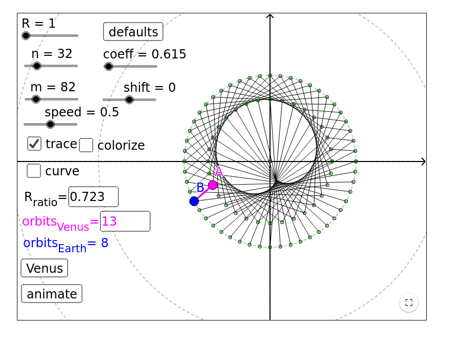

Cardioid
========

Preface
-------
Cardioid [1] is a well known function in mathematics that looks like a typical image of a human heart. Be aware that human heart does not look like this image, but for some reason people tend to think that it does. Cardioid was known for a long time, but was named by Giovanni Salvemini in 1741 [2]. In this article we will construct three dimensional object that looks like an imagination of a human heart based on cardioid. This image is often used when we speak about love (type of human relationship).

Definitions
-----------
Cardiod function is defined in polar coordinates as
 $$ x(\phi) = 2a(1 - \cos \phi) \cdot \cos \phi $$
 $$ y(\phi) = 2a(1 - \cos \phi) \cdot \sin \phi $$
 $$ 0 <= \phi < 2 \pi $$

It looks like showed on image 1:


Venus
------
Wikipedia defines Venus as a Roman goddess, whose functions encompass love, beauty, desire, sex, fertility, prosperity, and victory. In Roman mythology, she was the ancestor of the Roman people through her son, Aeneas, who survived the fall of Troy and fled to Italy. Julius Caesar claimed her as his ancestor. Venus was central to many religious festivals, and was revered in Roman religion under numerous cult titles. [3] But here we will be interested in a planet named Venus after this goddess.

Venus is the second planet from the Sun and the nearest to Earth [4]. Sometimes it is called Earth's 'sister' or 'twin'. Like the goddess this planet is often referenced as related to love on the Earth. Obviously it is not true but here we will describe what does Venus have common with cardioid.

Regarding [5] Venus orbit is very similar to Cardioid if we look on it from Earth. To see how it looks like one can use site from the reference. Hear is only the screenshot of this orbit.



So we can see the correlation between names and feelings of people makes sense here.

Valentine's Day
---------------------
From Wikipedia[6] Valentine's Day, also called Saint Valentine's Day or the Feast of Saint Valentine, is celebrated annually on February 14. It originated as a Christian feast day honoring one or two early Christian martyrs named Saint Valentine and, through later folk traditions, has become a significant cultural, religious, and commercial celebration of romance and love in many regions of the world.

Every year February 14 we can see a lot of hearts everywhere. The heart became a symbol of love so people tend to send gifts one other in the form of a heart. It is an old tradition, for example this post card originates in the year 1909.


Three dimensional Cardioid
---------------------------
To construct three dimensional cardioid we need to add the second parameter. To do it we will stack cardioids with different sizes. Size of the cardioid depends on it's height and is defined as
$$ a = s \cdot \sqrt{1 - z^2} $$

To make a three dimensional model we need to calculate points for each layer and then to make triangles of them. If we have N points in each layer and we have L layers we can define points as:

$$ z = j / L $$
$$ \phi = \frac{2 \pi \cdot i}{N} - \pi $$
$$ a = s \cdot \sqrt{1 - z^2} $$
$$ x = 2 a \cdot (1 - \cos \phi) \cdot \cos \phi $$
$$ y = 2 a \cdot (1 - \cos \phi) \cdot \sin \phi $$
$$ P_{i,j} = (x, y, z) $$
$$ j \in [0 \dots L - 1], i \in [0 \dots N - 1] $$

To construct top half of the cardioid we will need four sets of triangles:

$$ A_1 = \{ (P{i, j}, P{i + 1, j} : P{i, j + 1}), i \in [0 \dots N - 1], j \in [0 \dots L - 1] \} $$
$$ A_2 = \{ (P{i + 1, j}, P{i + 1, j + 1} : P{i, j + 1}), i \in [0 \dots N - 1], j \in [0 \dots L - 1] \} $$
$$ A_3 = \{ (P{i, L-1}, P{i + 1, L-1} : (0, 0, 1)), i \in [0 \dots N - 1] \} $$

For the bottom part we will need to change the order of points to have correct normal vectors but in the idea is the same.

Resulting cardioid is present on the image:


Conclusion
----------
Despite all the difficulties in our world we should make everything for love.
Make love not war!


Appendix: python code
---------------------
``` python
#!/usr/bin/env python3

import numpy as np
import sys

class Stl:
    def __init__(self):
        self.faces = [ ]

    def add_face(self, a, b, c):
        self.faces.append((a, b, c))

    def save(self, out, name = "Heart"):
        out.write(f"solid {name}\n")
        for a, b, c in self.faces:
            n = np.cross(c - a, b - a)
            n /= np.sqrt(np.sum(np.square(n)))
            out.write(f"""\
  facet normal {n[0]} {n[1]} {n[2]}
    outer loop
      vertex {a[0]} {a[1]} {a[2]}
      vertex {b[0]} {b[1]} {b[2]}
      vertex {c[0]} {c[1]} {c[2]}
   endloop
  endfacet
""")
        out.write("endsolid\n")

def cardioid(points = 20, layers = 10, zscale = 2.0):
    def vertex(i, j):
        z = (1.0 * j) / layers
        phi = (np.pi * i * 2.0) / points - np.pi
        a = zscale * np.sqrt(1.0 - z * z)
        x = 2.0 * a * (1.0 - np.cos(phi)) * np.cos(phi)
        y = 2.0 * a * (1.0 - np.cos(phi)) * np.sin(phi)
        return np.array([x, y, z])

    res = Stl();

    for l in range(layers - 1):
        for i in range(points):
            ni = (i + 1) % points
            res.add_face(vertex(i, l), vertex(ni, l), vertex(i, l + 1))
            res.add_face(vertex(ni, l), vertex(ni, l + 1), vertex(i, l + 1))

            res.add_face(vertex(ni, -l), vertex(i, -l), vertex(i, -l - 1))
            res.add_face(vertex(ni, -l - 1), vertex(ni, -l), vertex(i, -l - 1))

    top = np.array([0.0, 0.0, 1.0])
    bottom = np.array([0.0, 0.0, -1.0])
    for i in range(points):
        ni = (i + 1) % points
        res.add_face(vertex(i, layers - 1), vertex(ni, layers - 1), top)
        res.add_face(vertex(ni, 1 - layers), vertex(i, 1 - layers), bottom)

    res.save(sys.stdout)

if __name__ == '__main__':
    cardioid()
```

Reference
---------
  1. [Cardioid](https://encyclopediaofmath.org/index.php?title=Cardioid)
  2. [Hearty Munching on Cardioids](http://www.cut-the-knot.org/ctk/Cardi.shtml)
  3. [Venus (mythology)](https://en.wikipedia.org/wiki/Venus_(mythology)]
  4. [Venus](https://en.wikipedia.org/wiki/Venus)
  5. [Earth-Venus cardioid-like orbit patterns](https://www.geogebra.org/m/egcwbtds)
  6. [Valentine's Day](https://en.wikipedia.org/wiki/Valentine%27s_Day)